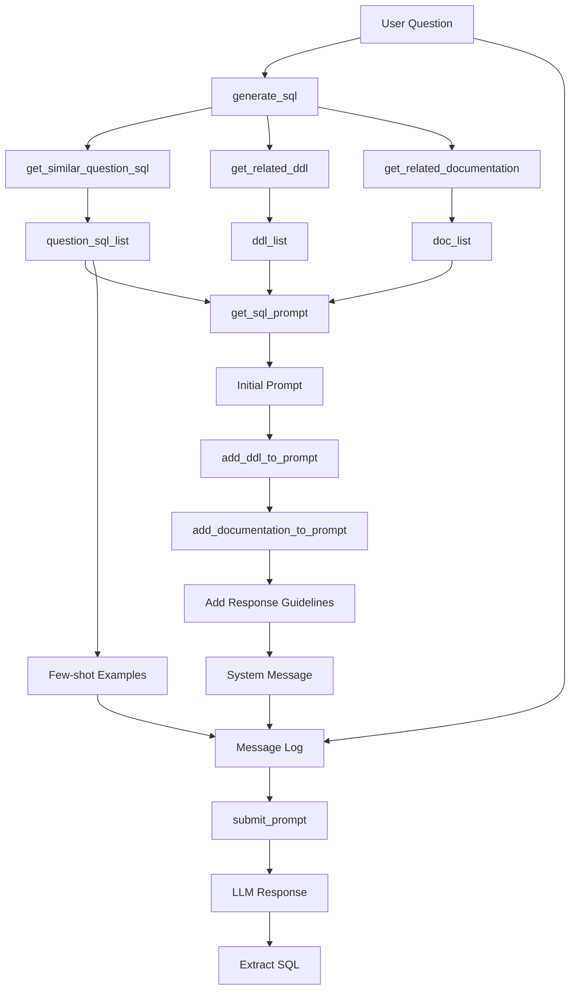

# Prompt Construction trong Vanna

## 📍 File chính xử lý Prompt Construction

**`src/vanna/base/base.py`** - Chứa tất cả logic xây dựng prompt

## 🔧 Các hàm chính

### 1. `get_sql_prompt()` - Hàm chính tạo SQL prompt

**Location**: `src/vanna/base/base.py` dòng 569-638

**Mục đích**: Xây dựng prompt hoàn chỉnh để gửi cho LLM generate SQL

**Input**:
```python
def get_sql_prompt(
    self,
    initial_prompt: str,      # System prompt ban đầu
    question: str,            # Câu hỏi của user
    question_sql_list: list,  # Danh sách câu hỏi + SQL tương tự
    ddl_list: list,          # Danh sách DDL/schema
    doc_list: list,          # Danh sách documentation
    **kwargs
)
```

**Output**: 
```python
[
    {"role": "system", "content": "You are a PostgreSQL expert..."},
    {"role": "user", "content": "Câu hỏi example 1"},
    {"role": "assistant", "content": "SQL example 1"},
    {"role": "user", "content": "Câu hỏi example 2"},
    {"role": "assistant", "content": "SQL example 2"},
    {"role": "user", "content": "Câu hỏi thực tế của user"}
]
```

**Cấu trúc Prompt**:

```
1. SYSTEM MESSAGE (initial_prompt):
   ┌─────────────────────────────────────────────────┐
   │ You are a {dialect} expert.                     │
   │ Please help to generate a SQL query...          │
   │                                                  │
   │ ===Tables                                        │
   │ CREATE TABLE sale (...)                         │
   │ CREATE TABLE customer (...)                     │
   │                                                  │
   │ ===Additional Context                            │
   │ • Documentation 1                                │
   │ • Documentation 2                                │
   │                                                  │
   │ ===Response Guidelines                           │
   │ 1. If context sufficient, generate SQL          │
   │ 2. If almost sufficient, use intermediate SQL   │
   │ 3. If insufficient, explain why                  │
   │ 4. Use most relevant tables                      │
   │ 5. Repeat exact answers if asked before          │
   │ 6. Ensure {dialect}-compliant SQL                │
   └─────────────────────────────────────────────────┘

2. EXAMPLES (Few-shot learning):
   ┌─────────────────────────────────────────────────┐
   │ USER: "Tổng doanh thu là bao nhiêu?"            │
   │ ASSISTANT: "SELECT SUM(sales) FROM sale"         │
   │                                                  │
   │ USER: "Top 5 sản phẩm bán chạy?"                │
   │ ASSISTANT: "SELECT name, SUM(sales)..."          │
   └─────────────────────────────────────────────────┘

3. ACTUAL QUESTION:
   ┌─────────────────────────────────────────────────┐
   │ USER: "Có bao nhiêu giao dịch trong tháng 10?"  │
   └─────────────────────────────────────────────────┘
```

### 2. `add_ddl_to_prompt()` - Thêm DDL/Schema

**Location**: `src/vanna/base/base.py` dòng 518-533

```python
def add_ddl_to_prompt(
    self, 
    initial_prompt: str, 
    ddl_list: list[str], 
    max_tokens: int = 14000
) -> str:
```

**Logic**:
1. Kiểm tra `len(ddl_list) > 0`
2. Thêm header `\n===Tables \n`
3. Loop qua từng DDL:
   - Tính token count
   - Nếu không vượt quá `max_tokens` → thêm vào prompt
   - Format: `{ddl}\n\n`

**Ví dụ output**:
```
===Tables 
CREATE TABLE public.sale (
    id INTEGER PRIMARY KEY,
    name TEXT,
    date DATE,
    sales MONEY
);

CREATE TABLE public.customer (
    id INTEGER PRIMARY KEY,
    name TEXT,
    email TEXT
);
```

### 3. `add_documentation_to_prompt()` - Thêm Documentation

**Location**: `src/vanna/base/base.py` dòng 534-552

```python
def add_documentation_to_prompt(
    self,
    initial_prompt: str,
    documentation_list: list[str],
    max_tokens: int = 14000,
) -> str:
```

**Logic**:
1. Thêm header `\n===Additional Context \n\n`
2. Loop qua documentation, check token count
3. Format: `{documentation}\n\n`

**Ví dụ output**:
```
===Additional Context 

Table 'sale' chứa dữ liệu bán hàng với:
- id: Mã giao dịch
- name: Tên sản phẩm hoặc khách hàng
- date: Ngày giao dịch
- sales: Doanh thu (kiểu money)

Để tính tổng doanh thu, dùng SUM(sales::numeric)
```

### 4. `add_sql_to_prompt()` - Thêm SQL Examples (không dùng cho SQL generation)

**Location**: `src/vanna/base/base.py` dòng 553-567

**Note**: Hàm này chỉ được dùng trong `get_followup_questions_prompt()`, KHÔNG được dùng trong `get_sql_prompt()`.

Trong SQL generation, examples được thêm trực tiếp qua message log (few-shot):
```python
for example in question_sql_list:
    message_log.append(self.user_message(example["question"]))
    message_log.append(self.assistant_message(example["sql"]))
```

### 5. Response Guidelines - Hardcoded trong prompt

**Location**: `src/vanna/base/base.py` dòng 617-625

```python
initial_prompt += (
    "===Response Guidelines \n"
    "1. If the provided context is sufficient, please generate a valid SQL query without any explanations for the question. \n"
    "2. If the provided context is almost sufficient but requires knowledge of a specific string in a particular column, please generate an intermediate SQL query to find the distinct strings in that column. Prepend the query with a comment saying intermediate_sql \n"
    "3. If the provided context is insufficient, please explain why it can't be generated. \n"
    "4. Please use the most relevant table(s). \n"
    "5. If the question has been asked and answered before, please repeat the answer exactly as it was given before. \n"
    f"6. Ensure that the output SQL is {self.dialect}-compliant and executable, and free of syntax errors. \n"
)
```

## 📊 Flow xử lý Prompt



**File**: `src/vanna/base/base.py` lines 93-168

```python
# 1. Retrieve context
question_sql_list = self.get_similar_question_sql(question, **kwargs)
ddl_list = self.get_related_ddl(question, **kwargs)
doc_list = self.get_related_documentation(question, **kwargs)

# 2. Build prompt
prompt = self.get_sql_prompt(
    initial_prompt=self.get_sql_prompt_prefix(**kwargs),
    question=question,
    question_sql_list=question_sql_list,
    ddl_list=ddl_list,
    doc_list=doc_list,
    **kwargs,
)

# 3. Submit to LLM
self.log(title="SQL Prompt", message=prompt)
llm_response = self.submit_prompt(prompt, **kwargs)

# 4. Extract SQL
sql = self._extract_sql(llm_response)
```

## 🎯 Ví dụ thực tế

### Input:
```python
vn.generate_sql("Có bao nhiêu giao dịch trong bảng sale?")
```

### Prompt được generate:

```json
[
  {
    "role": "system",
    "content": "You are a PostgreSQL expert. Please help to generate a SQL query to answer the question. Your response should ONLY be based on the given context and follow the response guidelines and format instructions. \n\n===Tables \nCREATE TABLE public.sale (\n    id INTEGER PRIMARY KEY,\n    name TEXT,\n    date DATE,\n    sales MONEY\n);\n\n===Additional Context \n\nTable 'sale' chứa dữ liệu bán hàng với:\n- id: Mã giao dịch\n- name: Tên sản phẩm hoặc khách hàng\n- date: Ngày giao dịch\n- sales: Doanh thu (kiểu money)\n\nĐể tính tổng doanh thu, dùng SUM(sales::numeric)\n\n===Response Guidelines \n1. If the provided context is sufficient, please generate a valid SQL query without any explanations for the question. \n2. If the provided context is almost sufficient but requires knowledge of a specific string in a particular column, please generate an intermediate SQL query to find the distinct strings in that column. Prepend the query with a comment saying intermediate_sql \n3. If the provided context is insufficient, please explain why it can't be generated. \n4. Please use the most relevant table(s). \n5. If the question has been asked and answered before, please repeat the answer exactly as it was given before. \n6. Ensure that the output SQL is PostgreSQL-compliant and executable, and free of syntax errors."
  },
  {
    "role": "user",
    "content": "Tổng doanh thu là bao nhiêu?"
  },
  {
    "role": "assistant",
    "content": "SELECT SUM(sales::numeric) as total_revenue FROM public.sale"
  },
  {
    "role": "user",
    "content": "Top 5 sản phẩm có doanh thu cao nhất?"
  },
  {
    "role": "assistant",
    "content": "SELECT name, SUM(sales::numeric) as total FROM public.sale GROUP BY name ORDER BY total DESC LIMIT 5"
  },
  {
    "role": "user",
    "content": "Có bao nhiêu giao dịch trong bảng sale?"
  }
]
```

## 🔍 Token Management

**Function**: `str_to_approx_token_count()`

**Location**: `src/vanna/base/base.py`

```python
def str_to_approx_token_count(self, string: str) -> int:
    return len(string) / 4
```

**Logic**: Mỗi token ≈ 4 characters

**Usage**:
```python
if (self.str_to_approx_token_count(initial_prompt) + 
    self.str_to_approx_token_count(ddl) < max_tokens):
    initial_prompt += f"{ddl}\n\n"
```

## ⚙️ Customization

### 1. Custom Initial Prompt

```python
# Override get_sql_prompt_prefix
class MyVanna(ChromaDB_VectorStore, OpenAI_Chat):
    def get_sql_prompt_prefix(self, **kwargs):
        return "You are an expert in Vietnamese SQL queries. "
```

### 2. Custom Dialect

```python
vn = MyVanna(config={
    'dialect': 'PostgreSQL'  # ← Ảnh hưởng initial_prompt và guidelines
})
```

Initial prompt sẽ là: `"You are a PostgreSQL expert..."`

Guidelines item 6: `"Ensure that the output SQL is PostgreSQL-compliant..."`

### 3. Custom max_tokens

```python
vn = MyVanna(config={
    'max_tokens': 8000  # ← Giới hạn context length
})
```

### 4. Custom Static Documentation

```python
vn.static_documentation = """
Database guidelines:
- Always use schema prefix: public.table_name
- Date format: YYYY-MM-DD
- Money type requires ::numeric for calculations
"""
```

Static doc sẽ được thêm vào tất cả prompts.

## 🎨 Best Practices

### 1. Train với examples chất lượng cao
```python
vn.train(
    question="Tổng doanh thu tháng 10?",
    sql="SELECT SUM(sales::numeric) FROM sale WHERE EXTRACT(MONTH FROM date) = 10"
)
```

### 2. Documentation rõ ràng
```python
vn.train(documentation="""
Table 'sale':
- Dùng sales::numeric cho tính toán
- date column: DATE type
- name column: TEXT (product or customer name)
""")
```

### 3. DDL đầy đủ
```python
ddl = """
CREATE TABLE public.sale (
    id INTEGER PRIMARY KEY,
    name TEXT NOT NULL,
    date DATE NOT NULL,
    sales MONEY NOT NULL
);

CREATE INDEX idx_sale_date ON public.sale(date);
"""
vn.train(ddl=ddl)
```

### 4. Set dialect phù hợp
```python
config = {
    'dialect': 'PostgreSQL',  # hoặc 'MySQL', 'SQL Server'
}
```

## 📝 Summary

| Component | File | Function | Purpose |
|-----------|------|----------|---------|
| **Main Prompt Builder** | `base.py` | `get_sql_prompt()` | Tạo message log hoàn chỉnh |
| **DDL Addition** | `base.py` | `add_ddl_to_prompt()` | Thêm table schemas |
| **Doc Addition** | `base.py` | `add_documentation_to_prompt()` | Thêm context docs |
| **SQL Generation** | `base.py` | `generate_sql()` | Orchestrate toàn bộ flow |
| **Token Counter** | `base.py` | `str_to_approx_token_count()` | Quản lý context length |

## 🚀 Debugging Tips

### 1. In ra prompt để xem
```python
prompt = vn.get_sql_prompt(
    initial_prompt="",
    question="Your question",
    question_sql_list=[...],
    ddl_list=[...],
    doc_list=[...]
)
print(json.dumps(prompt, indent=2, ensure_ascii=False))
```

### 2. Check token count
```python
prompt_str = json.dumps(prompt)
token_count = vn.str_to_approx_token_count(prompt_str)
print(f"Estimated tokens: {token_count}")
```

### 3. Enable logging
```python
# Vanna tự động log "SQL Prompt" khi generate_sql()
# Check terminal output
```
